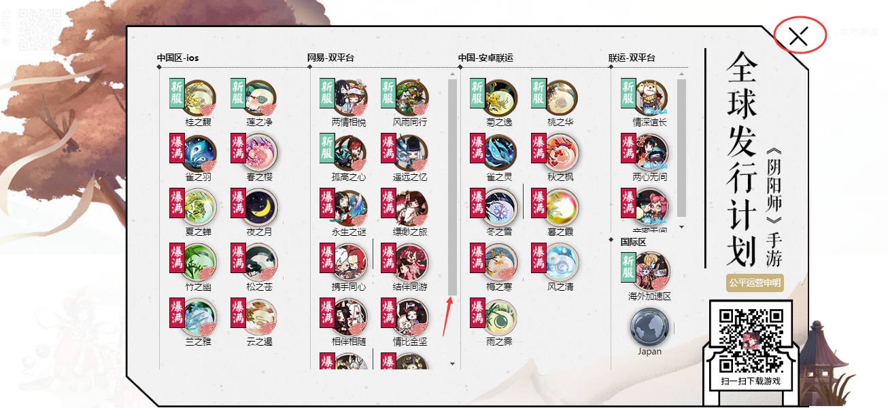
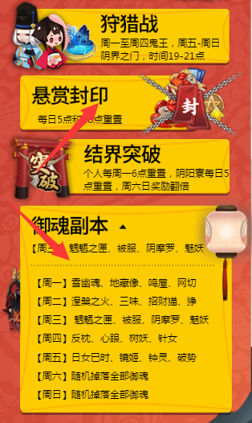
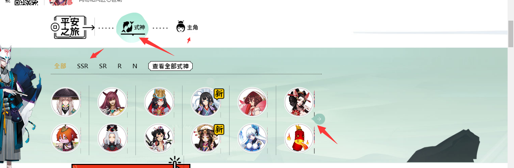
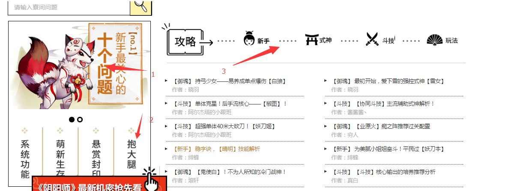
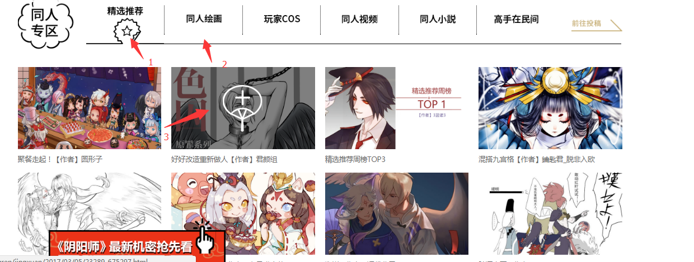
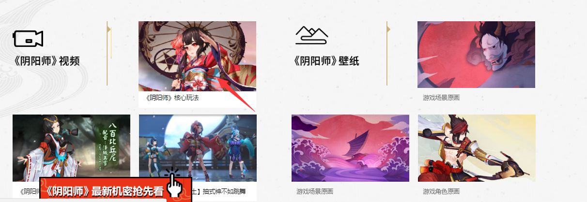

#
阴阳师数据分析报告

##正文：

###阴阳师网页一共分为12个模块，每个都存在相应的技术点和动画效果，接下来对每块功能点及数据进行分析。

框架的数据完整copy阴阳师数据：[http://http://yys.163.com/](http://http://yys.163.com/)
##第一块如图：

技术点1：红色方框中为hover触发下拉框display：block；

技术点2：利用jq技术实现滚动到导航栏高度时，弹出新的固定导航栏。

该块的数据值：width：100%； height：56px；font：12px；

---
##第二块如图：

技术点3：图片的弹出效果，使用animation改变位置，且加了些透明度。

技术点4：方框中青蛙那块采用jq的点击事件，弹出遮罩层。

技术点5：方框中青蛙那块使用transition实现雪碧图X的旋转。

技术点6：点击X采用scale实现整个图的放大和缩小效果。

该块的数据值h：585px、w：100%；、p：12px；

---

##第三块如图：

技术点7：采用jq实现二维码的光束连续扫视效果。

技术点8：使用jq对整块的移动（还可以采用input的checkbox属性在加上transition实现）

##第四块如图：

技术点9：采用transiform和transition实现

技术点10：使用jq实现下拉菜单。

##第五块如图：

技术点11：hover实现遮罩。

技术点12：jq点击事件实现切换。

技术点13:jq点击使用animate：500ms过渡。

---

##第六块如图：

技术点14：采用flex布局hover实现上下移动效果。

技术点15:利用input属性check实现点击切换效果。

数据：w：1200px，h：430px，font：12px

---

##第七块如图：

技术点16：hover实现遮罩。

技术点17：jq实现切换和过渡。

---
##第八、九块如图：

技术点18：方框中的图片采用scale实现放大效果。

技术点19：点击弹出遮罩层，类似青蛙那块。

---
##第十二块如图：

术点：hover后二维码弹出效果，在使用transition过渡。

